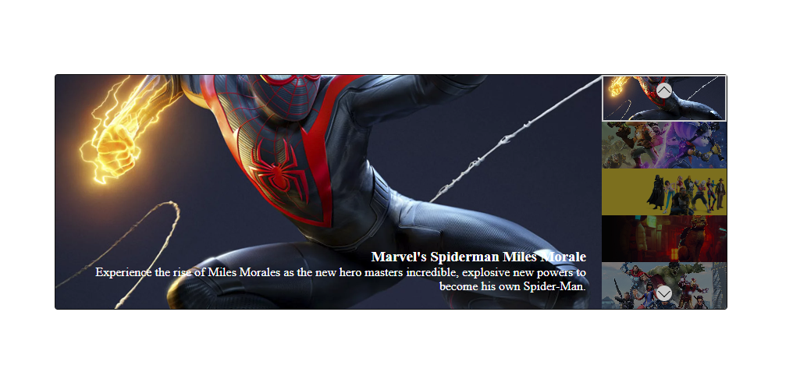

# JS ARRAY OBJECTS CAROUSEL

## Consegna
Dato un array di oggetti letterali con:
 - url dell’immagine
 - titolo
 - descrizione
Creare un carosello come nella foto seguente:
 

### Milestone 0
Creare un array di oggetti composto da Url, titolo e descrizione.

### Milestone 1
Usare l’array di oggetti letterali per popolare dinamicamente il carosello.
Al click dell'utente sulle frecce verso sinistra o destra, l'immagine attiva diventerà visibile e dovremo aggiungervi titolo e testo.

### Milestone 2
Aggiungere il ciclo infinito del carosello: ovvero se la miniatura attiva è la prima e l'utente clicca la freccia verso destra, la miniatura che deve attivarsi sarà l'ultima e viceversa per l'ultima miniatura se l'utente clicca la freccia verso sinistra.

### BONUS 1
Aggiungere le thumbnails (sottoforma di miniatura) ed al click attivare l’immagine corrispondente.

### BONUS 2
Aggiungere funzionalità di autoplay: dopo un certo periodo di tempo (3 secondi) l’immagine attiva dovrà cambiare alla successiva.

### BONUS 3
Aggiungere bottoni di start/stop e di inversione del meccanismo di autoplay.